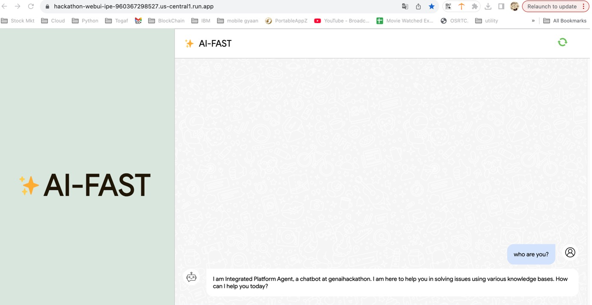

# 🚀 AI-FAST Generational Helpbot

## 📌 Table of Contents
- [Introduction](#introduction)
- [Demo](artifacts/demo/README.md)
- [Inspiration](#inspiration)
- [What It Does](#what-it-does)
- [How We Built It](#how-we-built-it)
- [Challenges We Faced](#challenges-we-faced)
- [How to Run](#how-to-run)
- [Tech Stack](#tech-stack)
- [Team](#team)

---

## 🎯 Introduction
This is a helpful Gemini gen ai llm bot which runs on grounded data coming from multiple sources from integrated enterprise platform and able to provide usuable solutions to the end user. End user will query the data using natural language and output will be in human understable format using RAG(Retrieval Augmentation Generation) behind the scenes

## 🎥 Demo
🔗 [Live Demo](#)(https://hackathon-webui-ipe-960367298527.us-central1.run.app/)  
📹 [Video Demo](artifacts/demo/DemoVideo/Demo_Video.mp4)

🖼️ [Screenshots](artifacts/demo/Screenshots/)


## 💡 Inspiration
Organizations have tons of data lying scattered acros different systems. Idea here is to organize it and provide a neat interface to the end user who can use natural language to find multitude of solutions which were hitherto unexplored

## ⚙️ What It Does
It provides a interface to the user to query through issues in natural language and find matching ones in lightning quick time

## 🛠️ How We Built It
We have used all tools from GCP - namely Agent Builder Agent.Datastore,Cloud Run,Cloud storage bucket,artifact registry,Bigquery and Gemini as LLM. terraform was used for building the infra set up and gcloud/python was used for building application front end.

## 🚧 Challenges We Faced
Major challenge was the time crunch to build this multi integration set up and making sure it works together. Another issue was in getting usable data. Ingestion of the data caused some challeneges but it was overcome a lot using gen ai itself .

## 🏃 How to Run
1. Clone the repository  
   ```sh
   git clone https://github.com/ewfx/gaipl-aifast.git
   ```
2. Install dependencies  
   ```sh
   pip install -r requirements.txt (for Python)
   ```
3. Run the project  
   ```sh
   click url of cloud run 
   ```

## 🏗️ Tech Stack
- 🔹 Frontend: python
- 🔹 Backend: dialogflow
- 🔹 Database: Datastore(vector database)

## 👥 Team
- **AI-FAST** - [GitHub](https://github.com/ewfx/gaipl-aifast/)
- **Teammate 1** - [GitHub](https://github.com/anilmm2005)
- **Teammate 2** - [GitHub](https://github.com/HarshaBhogi)
- **Teammate 3** - [GitHub](https://github.com/Vijay2869)
- **Teammate 4** - [GitHub](https://github.com/rabollam)
- **Teammate 5** - [GitHub](#)
